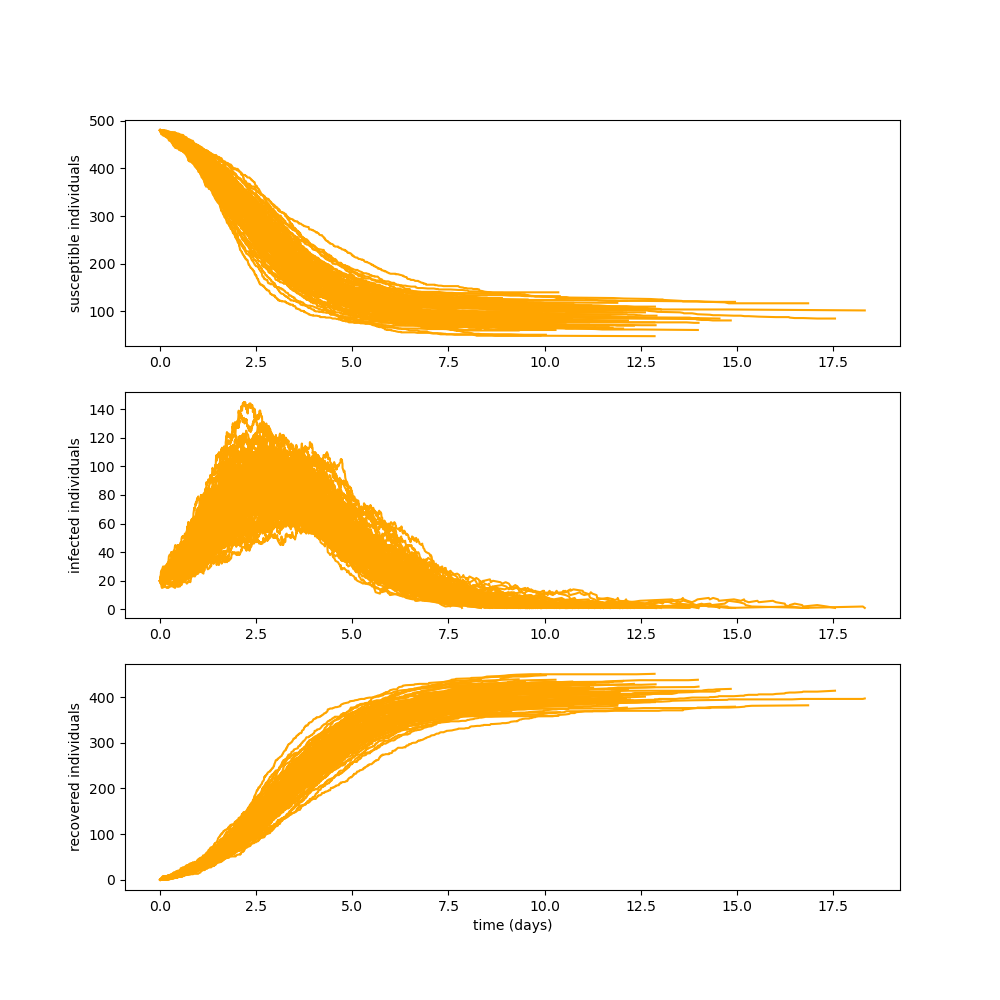

# Gillespie
Numba accelerated implementation of Gillespie's algorithm for simulating stochastic processes. This implementation is based on the following [project](https://github.com/wefatherley/monte-carlo).

This implementation can be 6 to 10 times faster but it is less user-friendly.

# Usage
Within gillespie.py, gillespie_direct() is the actual implementation of Gillespie's algorithm. The remaining of the code is an example of its usage on the SIR model as explained on this [wikipedia](https://en.wikipedia.org/wiki/Gillespie_algorithm) page.

To adapt this code to your situation, the following must be changed: data, stoichiometry and propensity()

# Results

    

Here is the result of 100 simulations on a population of 480 susceptible people and 20 infected. This result was achieved in 2.5 seconds. Results on a larger population can be achieved in a reasonnable amount of time but it requires a certain amount of RAM and you might need to subsamble the data fed to matplotlib.

# References
Exact stochastic simulation of coupled chemical reactions : https://pubs.acs.org/doi/abs/10.1021/j100540a008

Modéliser la propagation d’une épidémie : http://www.math.ens.fr/enseignement/telecharger_fichier.php?fichier=1693
